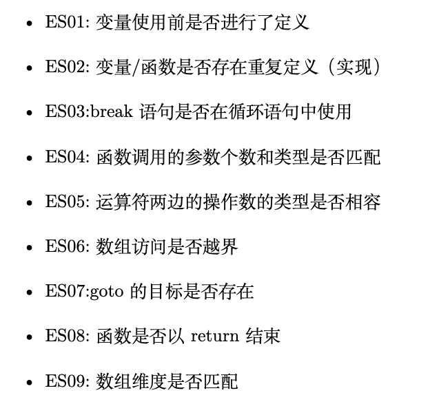

# 基于bitmicc的设计

[**BITMiniCC**](https://github.com/jiweixing/BIT-MiniCC)

### 使用方法

将相应的文件放置（替换）在bitmicc项目的对应的文件夹内。仅供学习参考。

在config.xml修改path进行调用

### 语法分析结果

在test文件夹中展示

### 语义分析结果

### 汇编生成

没有采用堆栈，是错误的，但修改也非常容易